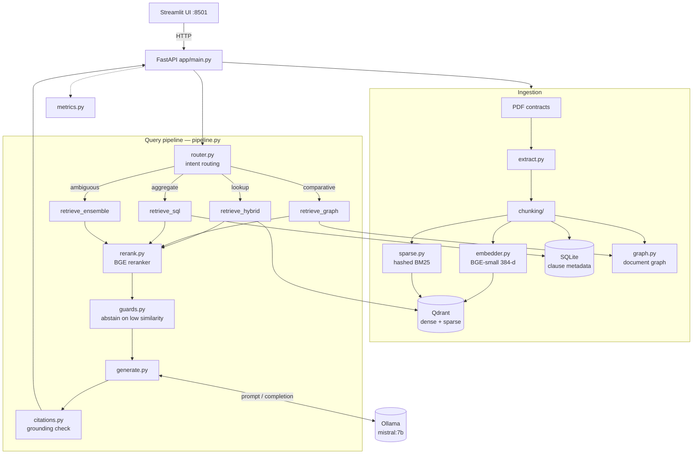

# Adaptive Local RAG for Legal Document Intelligence

Production-oriented **local** RAG (no cloud APIs). The MVP routes legal questions to hybrid, graph, or SQL retrieval, reranks with BGE, generates with Ollama Mistral-7B, and abstains on low similarity or ungrounded citations.


## Architecture



More detail: [docs/ARCHITECTURE.md](docs/ARCHITECTURE.md)

## Screenshots

| Overview | Query with grounded citations |
| --- | --- |
|  |  |

## Stack
- FastAPI + Streamlit
- Qdrant hybrid search (dense BGE-small 384-d + hashed BM25 sparse)
- Ollama `mistral:7b`
- SQLite clause metadata + in-memory document graph
- Docker Compose

## Quick start
```bash
python scripts/write_sample_pdfs.py
docker compose up --build
```
Wait for `ollama-init` to finish pulling Mistral. Open http://localhost:8501 and click **Ingest sample contracts**.

Without Docker (Qdrant + Ollama already running locally):
```bash
python -m venv .venv && source .venv/bin/activate
pip install -r requirements.txt
uvicorn app.main:app --reload
streamlit run ui/streamlit_app.py
```

## Failure modes
- Similarity &lt; 0.45: *I couldn't find relevant information. Please rephrase your query.*
- Router confidence &lt; 0.7: ensemble of hybrid + graph (+ SQL when numeric)
- Generated `[doc_id:page]` not in retrieved chunks: refuse to answer (answers with no citations are still shown)

## Evaluation and performance
See [eval/README.md](eval/README.md) and [benchmarks/README.md](benchmarks/README.md). Default embedder is BGE-small for 8GB-class machines.

```bash
pytest
```
