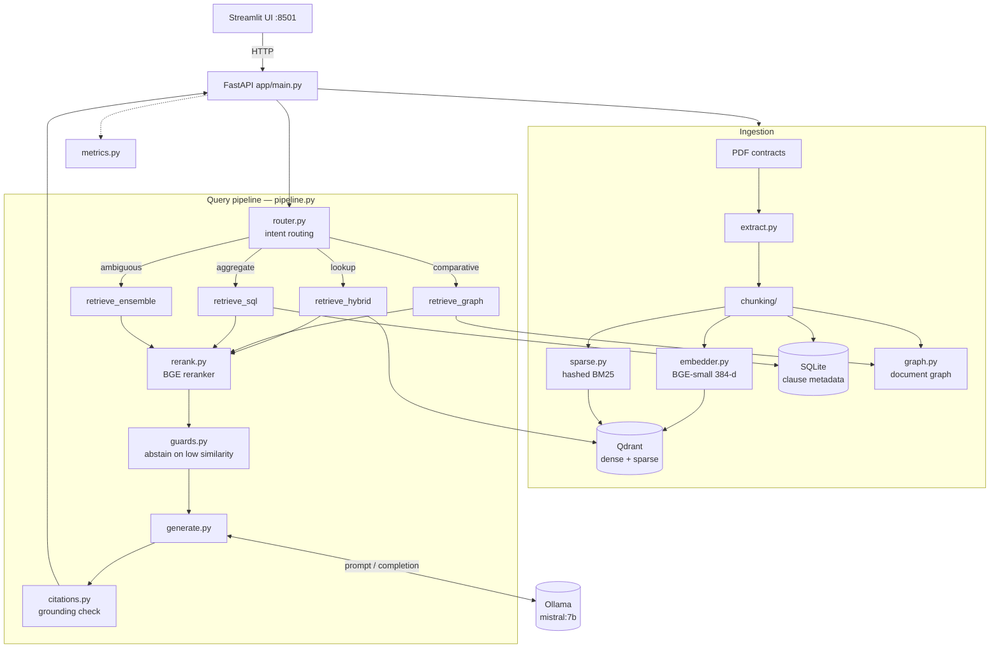

# Architecture

Local, adaptive RAG for legal documents: route → retrieve → rerank → guard → generate → verify citations.

Deployed with Docker Compose (`Dockerfile.api`, `Dockerfile.ui`, Qdrant, Ollama). `eval/` and `benchmarks/` measure retrieval quality and latency.
